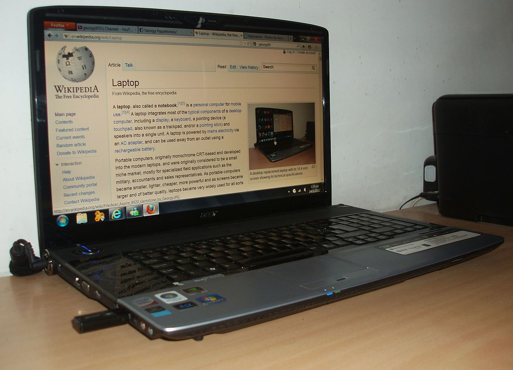
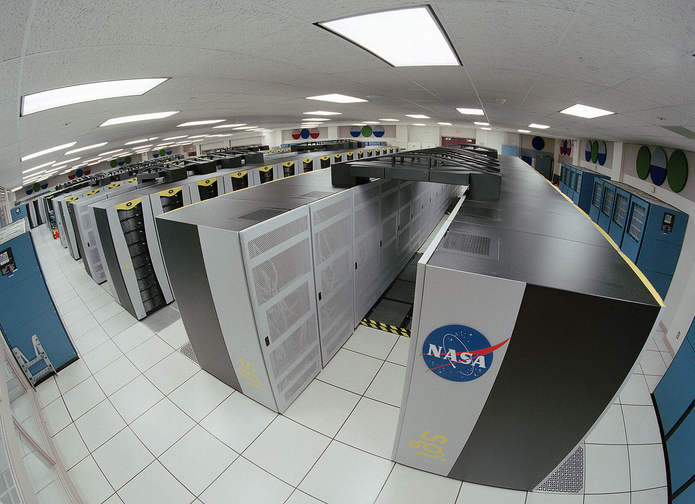

---
layout:default
---

Now I'm going to expiain some basic Software Engineering concepts.

# Computer 计算机
A computer is a device that can be instructed to carry out sequences of arithmetic or logical operations automatically via computer programming. Modern computers have the ability to follow generalized sets of operations, called programs. These programs enable computers to perform an extremely wide range of tasks. 
计算机是一种装置，它可以被指令通过计算机编程自动执行一系列算术或逻辑运算。现代计算机有能力遵循广义的操作集，称为程序。这些程序使计算机能够执行非常广泛的任务。
### Small image

### Small image

## Computer science 计算机科学
Computer science is the study of the theory, experimentation, and engineering that form the basis for the design and use of computers. It is the scientific and practical approach to computation and its applications and the systematic study of the feasibility, structure, expression, and mechanization of the methodical procedures (or algorithms) that underlie the acquisition, representation, processing, storage, communication of, and access to, information. An alternate, more succinct definition of computer science is the study of automating algorithmic processes that scale. A computer scientist specializes in the theory of computation and the design of computational systems.
计算机科学是对理论、实验和工程的研究，它是计算机设计和使用的基础。它是一种科学实用的计算方法及其应用，系统地研究了在一个系统的获取、表示、处理、存储、通信的基础上的方法步骤（或算法）的可行性、结构、表达和机械化及获取信息。计算机科学的另一种更简洁的定义是研究规模化算法过程的自动化。计算机科学家专门从事计算理论和计算系统的设计。

### Small image

### Software 软件
Computer software, or simply software, is a generic term that refers to a collection of data or computer instructions that tell the computer how to work, in contrast to the physical hardware from which the system is built, that actually performs the work. In computer science and software engineering, computer software is all information processed by computer systems, programs and data. Computer software includes computer programs, libraries and related non-executable data, such as online documentation or digital media. Computer hardware and software require each other and neither can be realistically used on its own. 
计算机软件，或简称软件，是一个通用术语，指的是一组数据或计算机指令，这些数据或计算机指令告诉计算机如何工作，这与实际执行工作的物理硬件形成对比。在计算机科学和软件工程中，计算机软件是由计算机系统、程序和数据处理的所有信息。计算机软件包括计算机程序、库和相关的不可执行数据，如联机文档或数字媒体。计算机硬件和软件需要彼此，而且它们本身都不能真正地独自使用。 
### Small image
.svg.png )

#### Software engineering 软件工程
Software engineering is the application of engineering to the development of software in a systematic method.

Notable definitions of software engineering include: 
"the systematic application of scientific and technological knowledge, methods, and experience to the design, implementation, testing, and documentation of software"—The Bureau of Labor Statistics—IEEE Systems and software engineering - Vocabulary
"The application of a systematic, disciplined, quantifiable approach to the development, operation, and maintenance of software"—IEEE Standard Glossary of Software Engineering Terminology
"an engineering discipline that is concerned with all aspects of software production"—Ian Sommerville
"the establishment and use of sound engineering principles in order to economically obtain software that is reliable and works efficiently on real machines"—Fritz Bauer

软件工程是工程应用于软件开发的一种系统方法。

软件工程的显著定义包括：              
“科学知识、方法和经验在软件设计、实施、测试和文档化中的系统应用”——劳工统计局IEEE系统和软件工程-词汇              
“系统、规范、可量化的方法在软件开发、运行和维护中的应用”——IEEE软件工程术语标准词汇      
“一个涉及软件生产的各个方面的工程学科”——Ian Sommerville              
“建立和使用健全的工程原理，以经济地获得可靠和有效的软件在真实的机器上工作”-弗里茨鲍尔 

##### Alan Turing 艾伦·图灵
Alan Mathison Turing (23 June 1912 – 7 June 1954) was an English computer scientist, mathematician, logician, cryptanalyst, philosopher, and theoretical biologist.Turing was highly influential in the development of theoretical computer science, providing a formalisation of the concepts of algorithm and computation with the Turing machine, which can be considered a model of a general purpose computer.Turing is widely considered to be the father of theoretical computer science and artificial intelligence.However, he was also a tragic figure: a hero who was never fully recognized in his home country during his lifetime due to his homosexuality (which was then considered a crime in the UK). 
艾伦·马蒂森·图灵(1912年6月23日—1954年6月7日)是英国计算机科学家、数学家、逻辑学家、密码分析家、哲学家和理论生物学家。关于图灵机的算法和计算的概念，图灵机可以被认为是通用计算机的模型。图灵被广泛认为是理论计算机科学和人工智能之父。然而，他也是一个悲剧人物：一个英雄。由于他的同性恋（当时在英国被认为是犯罪），他在自己的祖国从未被完全承认。
### Small image

###### Moore's law 穆尔定律
Moore's law is the observation that the number of transistors in a dense integrated circuit doubles about every two years. The observation is named after Gordon Moore, the co-founder of Fairchild Semiconductor and Intel, whose 1965 paper described a doubling every year in the number of components per integrated circuit,and projected this rate of growth would continue for at least another decade.In 1975,looking forward to the next decade,he revised the forecast to doubling every two years.The period is often quoted as 18 months because of a prediction by Intel executive David House (being a combination of the effect of more transistors and the transistors being faster).
穆尔定律是在一个密集的集成电路中晶体管的数量大约每两年增长一倍的观察。这个观察是以费尔柴尔德半导体和英特尔的联合创始人戈登·摩尔的名字命名的，他在1965年的论文中描述了每个集成电路的元件数量每年翻一番，并预测这种增长速度将持续至少十年。展望未来十年，他把预测修正为每两年翻一番。由于英特尔执行官大卫·豪斯的预测（晶体管效应越大，晶体管效应越快），这一时期常常被引用为18个月。
### Small image

